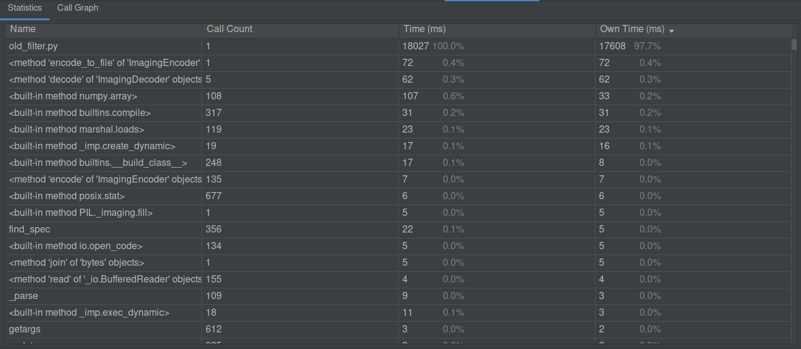
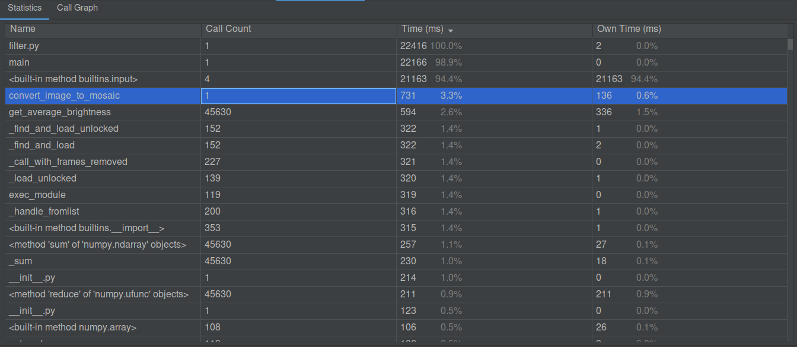
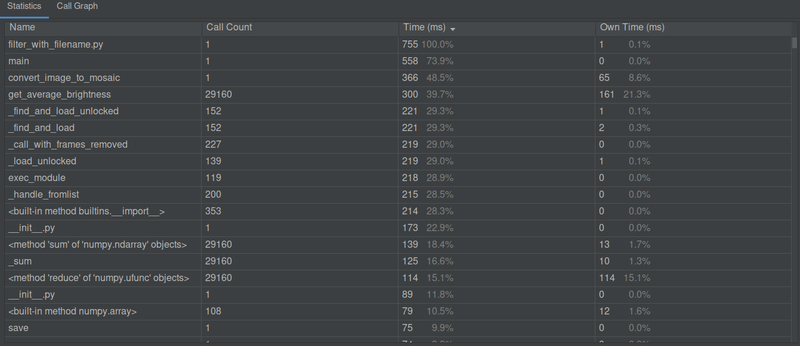
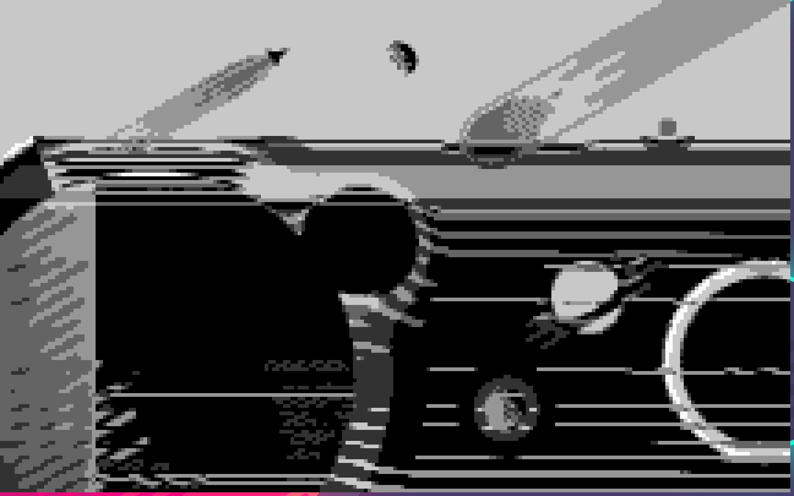
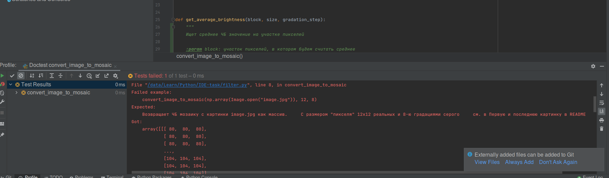
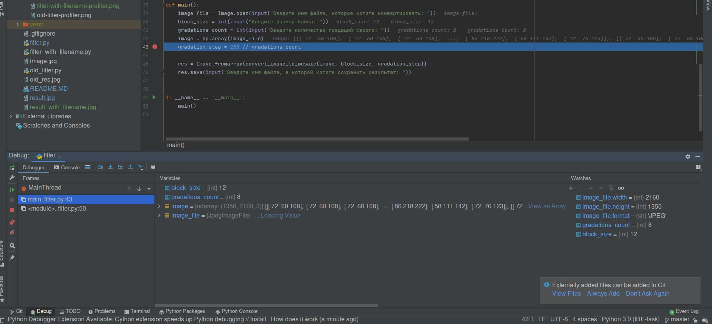

# IDE TASK
## Первый замер скорости

По общему времени, новый фильтр работал медленнее из-за ввода пользователя.
В то же время, нельзя сравнивать время выполнения основной функции (выделена на 2-й каринке) с общим временем 1-го варианта, потому что на запуск питона как такового тратится много времени

## Второй замер скорости

Теперь точно видно, что новый фильтр работает в **десятки раз** быстрее, чем старый.
Это происходит в основном из-за использования библиотеки numpy, которая написана на c++, и выполняет операции со своими массивами намного быстрее, чем "обычный" python.

## Результаты работы алгоритмов:
- Исходная картинка:

- Старый алгоритм (размер блока 10 и 50 градаций серого):

- Новый алгоритм для бенчмарка. *Параметры такие же, как у старого, а именно размер блока 10 и 50 градаций серого)*:

- Новый алгоритм, поигрался с параметрами. Размер блока 12 и 8 градаций серого. Какая красота!

## Док текст

Я считаю, что док-тексты __не предназначены__ для проверки функции, которая принимает и выдаёт здоровенный __**3-х мерный массив**__.
Именно поэтому я лишь описал результат работы, соответственно, формально в pycharm тест не проходит.
Как я по вашему должен расписать какой-то понятный пример и результат?
*P.S. Заранее извиняюсь за негатив. Дело было поздней ночью, моё терпение подходило к концу...*

## Отладка

Все нужные значения в "Watches"